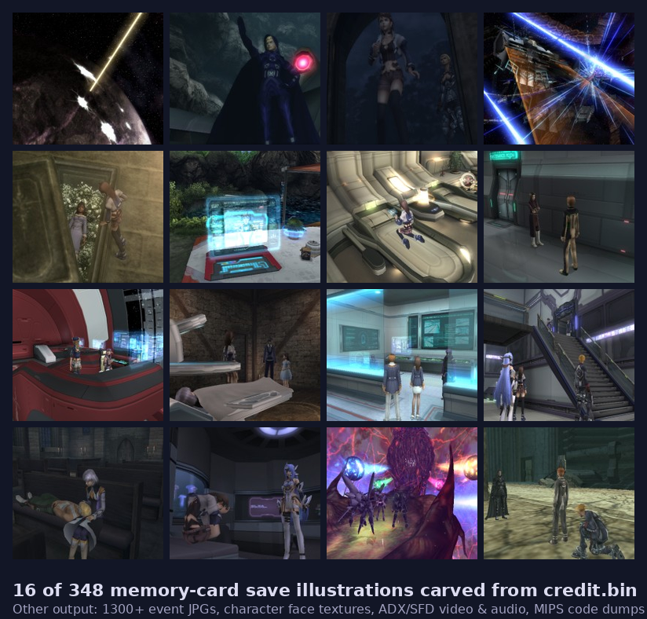

# Xenosaga III Python Extractor

By Jessi Ray Godsibb. Originally bootstrapped with ChatGPT; rebuilt around the
corrected disc model.

Extracts game assets from the Xenosaga III ISOs using only Python + 7-Zip. No
legacy EXEs (Xeno23Lbae, xenounpack, XenoLbar, XenoRepack) needed at runtime —
just the LBA tables those tools produce.

> **Beta — feedback wanted.** Please open issues at
> <https://github.com/LinuxJessi/Xenosaga3PythonExtractor/issues> with
> anything that surprises you: extraction errors, GUI quirks, paths that
> don't auto-detect on your OS, decompiled-format weirdness. The extraction
> core is well-tested on both discs; the GUI and the texture/audio
> converters are newer and less battle-hardened. **Use your own legally
> obtained discs only.**

> **For curious testers:** [`docs/disc-catalog.md`](docs/disc-catalog.md)
> is the full data dictionary — every file extension across both discs,
> what it actually is, where the engine reads it from, plus a "Fun finds"
> section at the bottom (developer names left in the binaries, the locale
> table for languages that never shipped, KOS-MOS as a literal C struct
> field, why `credit.bin` isn't actually credits, etc.).

## What you get


*The local web GUI — ten cards walk you through the full pipeline,
from "point at an ISO" through "browse decoded textures and movies."*



*Output: 1,300+ event illustrations, 348 memory-card save scenes
(above), every character face texture, every cutscene as MP4, every
voiced line as WAV, and the entire game's compiled MIPS code as a
disassembly dump. Real extraction; nothing reconstructed or upscaled.*

## Quick start — GUI (recommended)

Most people will want this path. **It opens in your browser; nothing is
exposed to the internet — the server only listens on `127.0.0.1`.**

### Windows — pre-built (easiest, available since v0.2.3)

Skip the entire "install Python, install 7-Zip, install ffmpeg" dance.
The Windows release zip contains everything — just download, extract,
double-click.

1. Download
   **[the latest Windows release zip](https://github.com/LinuxJessi/Xenosaga3PythonExtractor/releases/latest)**
   (look for `Xenosaga3-Extractor-X.Y.Z-win64.zip` under *Assets*, ~95 MB).
2. Right-click → **Extract All…** anywhere you have space. **Extracting
   matters** — double-clicking `gui.exe` from inside the zip preview will
   *not* work.
3. Double-click **`gui.exe`**. The first time, Windows will warn
   "Windows protected your PC." Click **More info → Run anyway**. See
   *["Why Windows warns the first time"](#why-windows-warns-the-first-time)*
   below.

That's it. Your browser opens to the GUI; the Environment panel should
show green ticks for 7-Zip, ffmpeg, Pillow, and capstone (all bundled).
The optional `pip install` and the separate ffmpeg / 7-Zip installs in
the manual section below are **not** needed for the pre-built.

#### Why Windows warns the first time

The download isn't (yet) signed with a Microsoft-trusted code-signing
certificate, so SmartScreen flags it as "unrecognized." This is a
reputation system, not a malware verdict — the file is exactly the one
GitHub Actions built from the source in this repo (build log:
`https://github.com/LinuxJessi/Xenosaga3PythonExtractor/actions`).

What we do to keep the warning small:

* **No installer** — just a zip you extract. Installers trigger heavier
  SmartScreen heuristics than plain zips.
* **No UPX packing** of the executables (UPX is the single strongest
  "this is malware" signal in most AV engines' weights).
* **Full Windows version-info resource** on both `.exe` files, so
  Properties → Details shows a real company name and description.
* **One-folder layout** — no unpacking to `%TEMP%` at startup, which is
  the most-flagged behaviour of one-file bundles.
* **Build is fully reproducible from GitHub Actions** — feel free to
  diff your downloaded zip against the workflow's published artefact.

What's still on the roadmap: applying for the free
[SignPath.io OSS programme](https://signpath.org/) or paying for
[Azure Trusted Signing](https://learn.microsoft.com/en-us/azure/trusted-signing/)
(~$10/month). Either eliminates the warning entirely.

If you'd rather not click through, use the manual-install path below or
run from source.

### Windows — manual install

1. Install **Python 3.8 or newer** from <https://www.python.org/downloads/>.
   **Tick "Add Python to PATH"** on the first installer screen — this is the
   single most common cause of "it won't launch" reports.
2. Install **7-Zip** from <https://www.7-zip.org/>. The default install
   location (`C:\Program Files\7-Zip\`) is auto-detected — no PATH tweaks
   needed.
3. *(Optional, only if you want SFD→MP4 video and ADX→WAV audio)* Install
   **ffmpeg**. Easiest: <https://www.gyan.dev/ffmpeg/builds/> → "release
   essentials" zip. Drop it under `C:\ffmpeg\` so the binary lives at
   `C:\ffmpeg\bin\ffmpeg.exe` (auto-detected). Or `winget install
   Gyan.FFmpeg` (also auto-detected).
4. *(Optional, only if you want texture-image and disassembly features)* Open
   PowerShell or Command Prompt **in the extractor folder** and run:
   ```
   pip install -r requirements.txt
   ```
5. **Double-click `launch.bat`.** A console window opens, prints the URL it
   bound to, and your default browser opens to it. Leave the console window
   open while you use the GUI — closing it shuts the server down.

### macOS

1. Install **Python 3** if you don't have it (`brew install python` or from
   python.org).
2. Install **7-Zip** (`brew install p7zip`) and optionally **ffmpeg**
   (`brew install ffmpeg`).
3. *(Optional)* `pip3 install -r requirements.txt` for textures + disasm.
4. **First-time setup**: open Terminal in the extractor folder and run
   `chmod +x launch.command` (one-time — Finder won't let you double-click
   it otherwise).
5. **Double-click `launch.command`.** Terminal opens, prints the URL, and
   your browser opens to it.

### Linux

1. `sudo apt install python3 p7zip-full ffmpeg` (or your distro's equivalent).
2. *(Optional)* `pip3 install -r requirements.txt`.
3. **First-time setup**: `chmod +x launch.sh` in a terminal.
4. **Double-click `launch.sh`** in your file manager (set to "Run" if it
   asks), or just run `./launch.sh` in a terminal.

### What you see in the GUI

A right-side **Environment** panel shows whether 7-Zip, ffmpeg, Pillow, and
capstone were found. Green = good. Red = install that thing if you want the
feature it powers (you can run the basic extraction without ffmpeg / Pillow /
capstone; they're each needed only for specific steps).

The main area is **ten cards in order**. Click a card header to expand it.
Run them top-to-bottom the first time. Every card has a **"Show command"
button** that previews what would run without executing — useful for
debugging.

Per disc:
1. **Check setup** — quick smoke test, shows what's in the work dir.
2. **Extract X3.\* from ISO** — pulls the seven bigfiles out. ~3 min.
3. **Assign LBA → containers** — wires which LBA file describes which
   bigfile chain. Pre-filled with Disc 1 defaults; flip to
   `Lba2.txt=X3.21,X3.22,X3.23` + ignore `X3.00 X3.20` for Disc 2.
4. **TOC summary** — sanity-check the LBA tables.
5. **Build extraction manifest** — resolves every row to a `(file,
   offset)`. Fast.
6. **Extract assets** — slices ~13,500 files out per disc. ~10 s.
7. **Verify** — checks sizes (+ optional SHA-1) against the manifest.
8. **Extract code** — pulls SLUS executable, OVL overlays, IOP modules.
9. **Build browse tree** — converts to viewable / playable formats. ~30 s.
10. **Disassemble code** — MIPS R5900 disasm + string xrefs.

### Stopping the GUI

Close the terminal/console window the launcher opened, or hit Ctrl+C in it.

## What the disc actually looks like

The Lybac toolchain treats each disc as a small set of **catalog** files plus
ordered **bigfile** chains:

| Disc | Catalog (small) | Bigfile chain | LBA file |
|------|------------------|---------------------------|--------------|
| 1, 2 | `X3.00` (~110 KB) | `X3.01` + `X3.02`           | `Lba0.txt` |
| 1    | `X3.10` (~52 KB)  | `X3.11` + `X3.12` + `X3.13` | `Lba1.txt` |
| 2    | `X3.20` (~26 KB)  | `X3.21` + `X3.22` + `X3.23` | `Lba2.txt` |

The 3.0x chain is **identical on both discs** (system/UI/models). 3.1x lives
on Disc 1 only, 3.2x on Disc 2 only.

Each LBA file is its own byte address space starting at `0`. Offsets and sizes
inside the LBA text are **bytes**, not sectors. Bigfile chains are walked as
one concatenated region — a single LBA row can span two bigfiles where the
file straddles a boundary (only a handful do in practice).

### Why v0.1 corrupted files

The first cut treated **all** X3.* parts as a single flat address space, so
every row from Lba1 and Lba2 was read from the start of the X3.* chain rather
than from its own region. Lba0 rows were already at offset 0 of the chain and
happened to land correctly, which is why "80% looked fine" while everything
under `\evt`, `\mov` and `\snd` came out as garbage.

## Requirements

- **Python** 3.8+ (Windows / macOS / Linux / WSL)
- **7-Zip** (`prep` and `code-extract`). On Windows install 7-Zip; on
  macOS/Linux install `p7zip-full`. Pass `--sevenzip /path/to/7z.exe` if it
  isn't on `PATH`.
- **ffmpeg** (only for `browse` kinds `audio` / `movies`; the `soundbanks`
  kind decodes `.dap` banks in pure Python). Static builds work
  fine; pass `--ffmpeg /path/to/ffmpeg` if it isn't on `PATH`.
- Optional Python deps (`pip install -r requirements.txt`):
  - **Pillow** — needed for `browse --kinds textures_png` (XTX/TM2 → PNG).
  - **capstone** — needed for `disasm` (MIPS R5900 disassembly + string xrefs).

  The core extraction pipeline (`prep` / `scan` / `extract` / `verify` /
  `map-regions` / `toc` / `doctor`) has **no** Python dependencies — only
  7-Zip on PATH.

## GUI (double-click to launch)

Don't want to type commands? Double-click the launcher for your OS:

| OS | File | Notes |
|---|---|---|
| Windows | `launch.bat` | Uses the Windows `py` launcher or `python` on PATH. |
| macOS | `launch.command` | First run: `chmod +x launch.command`. Opens in Terminal. |
| Linux | `launch.sh` | First run: `chmod +x launch.sh`. |

The launcher starts a local web server on a free port and opens your browser.
The GUI is a dashboard of cards — one per pipeline step (doctor / prep /
map-regions / toc / scan / extract / verify / code-extract / browse /
disasm), each with the same form fields the CLI takes. Subprocess output
streams live into a side panel via Server-Sent Events. The auto-detect tab
on the right also tells you whether `ffmpeg`, `7-Zip`, `Pillow`, and
`capstone` are present.

Plain HTTP, bound only to `127.0.0.1` — nothing reaches the network.

You can also run it directly:

```bash
python gui.py            # opens default browser
python gui.py --no-browser
PORT=8080 python gui.py  # pin the port
```

## Workflow (command line)

Per-disc, in a clean directory.

```bash
# 0. Sanity check
python cli.py doctor --work .

# 1. List the ISO and extract the X3.* parts. Writes container_map.json.
python cli.py prep --iso "...Disc 1).iso" --work .  # or pass --sevenzip path

# 2. Assign LBA sources to bigfile chains. Auto works for clean discs;
#    manual gives you explicit control.
python cli.py map-regions --work . \
    --assign "Lba0.txt=X3.01,X3.02" \
    --assign "Lba1.txt=X3.11,X3.12,X3.13" \
    --ignore X3.00 --ignore X3.10

# 3. (Optional) human summary of the LBA tables.
python cli.py toc --work .

# 4. Build the extraction manifest (one row per LBA entry, resolved to a
#    container + local offset). Sniff-magics in the log help spot anomalies.
python cli.py scan --work . --sniff

# 5. Dry-run to see what would be written.
python cli.py extract --work . --out ./dump --dry-run

# 6. Real extract. --hash records SHA-1s under dump/_reports/hashes.sha1.
python cli.py extract --work . --out ./dump --hash

# 7. Spot-check sizes (and optionally re-verify the SHA-1s).
python cli.py verify --work . --out ./dump --limit 500 --hash

# 8. (Optional) extract non-X3 files from the ISO (SLUS, OVL, IRX,
#    SYSTEM.CNF). Mirrors the ISO's filesystem under --out.
python cli.py code-extract --iso "...Disc 1).iso" --out ./browse/code

# 9. (Optional) build a sibling browse/ tree of viewable / playable files.
#    Needs ffmpeg on PATH (for audio/movies) and `pip install Pillow` (for
#    textures_png). --stage is a fast scratch dir; --out is the final
#    destination (omit to keep outputs in --stage). `--kinds` filters
#    which categories to produce; default is all.
python cli.py browse \
    --dump ./dump \
    --stage /fast/disk/stage \
    --out ./browse \
    --jobs 6 \
    --kinds images,text,textures,textures_png,audio,movies,carved

# 10. (Optional) MIPS R5900 disassembly + lui/addiu string xrefs for SLUS
#     and the three OVL overlays. Needs `pip install capstone`.
python cli.py disasm --code-dir ./browse/code
```

Disc 2 is the same flow with a fresh `--work` directory, using `Lba0.txt` +
`Lba2.txt` against `X3.01/02` and `X3.21/22/23`.

## Outputs

- `container_map.json` — v2 schema: `containers` (name+size) and `regions`
  (LBA filename → ordered chain of container names).
- `disc_7z_list.txt` — raw 7-Zip listing.
- `toc/toc_headers.json` — by-source / by-top / by-ext summary.
- `out/manifest_merged.csv` — every LBA row plus the resolved container, the
  local offset, the comma-separated chain it touches, and a `map_status`.
- `dump/<in-game path>` — extracted files.
- `dump/_reports/extract.log` — per-row log line (`OK`, `SKIP`, `ERR`).
- `dump/_reports/hashes.sha1` — SHA-1 of every written file (when `--hash`).

## Subcommands

| Command         | What it does |
|-----------------|--------------|
| `doctor`        | Prints `container_map.json`, on-disk X3.\*, LBA max-ends. |
| `prep`          | 7-Zip listing + X3.\* extraction + v2 `container_map.json` (no regions). |
| `container-map` | Rebuild `container_map.json` from a saved 7-Zip listing (no re-extract). |
| `map-regions`   | Assign each `Lba*.txt` to a container chain (`--assign` or auto). |
| `toc`           | Human-readable summary of the merged LBA tables. |
| `scan`          | Walks every LBA row, resolves to `(container, local_offset)`, writes manifest. |
| `extract`       | Slice bytes per the manifest into a mirrored tree. |
| `verify`        | Cross-check extracted file sizes (and optionally SHA-1) against the manifest. |
| `browse`        | Build a sibling `browse/` tree. Categories (`--kinds`): `images` (JPG copy), `text` (TXT/MES copy), `textures` (XTX/TM2/TXD/TXY/BMP/PNG raw copy), `textures_png` (XTX/TM2 → PNG decode, Pillow needed), `audio` (ADX → WAV, ffmpeg), `movies` (SFD → H.264 MP4, ffmpeg), `carved` (JPGs carved from `credit.bin`-style containers). |
| `code-extract`  | Run 7-Zip over the ISO to pull the non-X3 files (SLUS, OVL, IRX, SYSTEM.CNF) into a directory. |
| `disasm`        | MIPS R5900 disassembly + `lui`/`addiu` string xrefs for SLUS / OVL ELFs. Needs `capstone`. |

### Character-texture modding

| Command         | What it does |
|-----------------|--------------|
| `chr-decode`    | Decode every texture inside a `.chr` (or `.wpn`/`.sme`) to PNG, plus the raw atlas + index map. |
| `chr-palettes`  | Export each texture's 256-color CLUT as an editable 16×16 PNG swatch (one pixel = one color). |
| `chr-import-palettes` | Write edited swatch PNGs back into a `.chr` (lossless round-trip for untouched entries). |
| `chr-import-entry` | Repaint a texture from a same-size PNG, quantized to its existing palette (experimental). |
| `chr-recolor`   | Hair recolor of one `.chr` — `--mode blue` (KOS-MOS-style color filter) or `--mode warm` (Shion-style name policy), `--hue 0..1`. |
| `chr-iso-extract` | Pull one file out of an ISO by its disc path, via the Lba tables. |
| `chr-iso-patch` | Write a same-size file back into an ISO, read-back verified. |
| `chr-iso-sweep` | Recolor every matching `.chr` in an ISO in place (work on a copy!). Same offsets on Disc 1 and Disc 2. |

The GUI has cards for the common path (decode → export palettes → import →
sweep). Guide with the full workflow incl. image-editor palette editing:
[docs/MODDING-CHARACTERS.md](docs/MODDING-CHARACTERS.md); byte-level spec:
[docs/chr-txy-format.md](docs/chr-txy-format.md). The underlying module
also works standalone with positional args: [`chrtex.py`](chrtex.py).

## Common issues

**`Missing container_map.json`** — run `prep` or `container-map` first.

**`{path} has no `regions` mapping`** — `prep` only writes container sizes;
you still need `map-regions` before `scan`.

**Auto-assign refuses with `Leftover containers`** — the heuristic sees
catalog files it doesn't recognise. Re-run with explicit `--ignore X3.00
--ignore X3.10` (Disc 1) or `--ignore X3.00 --ignore X3.20` (Disc 2). Or skip
auto entirely and pass `--assign` strings.

**`unmapped` rows in the manifest** — an LBA entry's offset falls outside
its region's container chain. Usually means the assignment is wrong; check
the `doctor` output and verify the LBA's max byte-end against the chain
size.

**WSL + Windows 7-Zip** — the bundled `iso_ops.py` calls a `7z` binary on
the `PATH`. From WSL you can either install `p7zip-full`, or wrap the
Windows-side `7z.exe`:

```bash
# Optional WSL wrapper
mkdir -p ~/.local/bin
cat > ~/.local/bin/7z <<'SH'
#!/bin/bash
"/mnt/c/Program Files/7-Zip/7z.exe" "$@"
SH
chmod +x ~/.local/bin/7z
```

`7z.exe` reaches WSL paths via `\\wsl.localhost\<distro>\...` if you ever
need to pass them manually.

## FAQ

**Does this modify the ISOs?** No, it only reads them; everything else is
written under `--work` and `--out`.

**Can I run scan/extract again after editing the manifest?** Yes —
`scan` is idempotent. `extract` overwrites destination files.

**Is the data fair use?** Jessi owns physical copies of both discs; the
extraction here is for personal archival/study.
