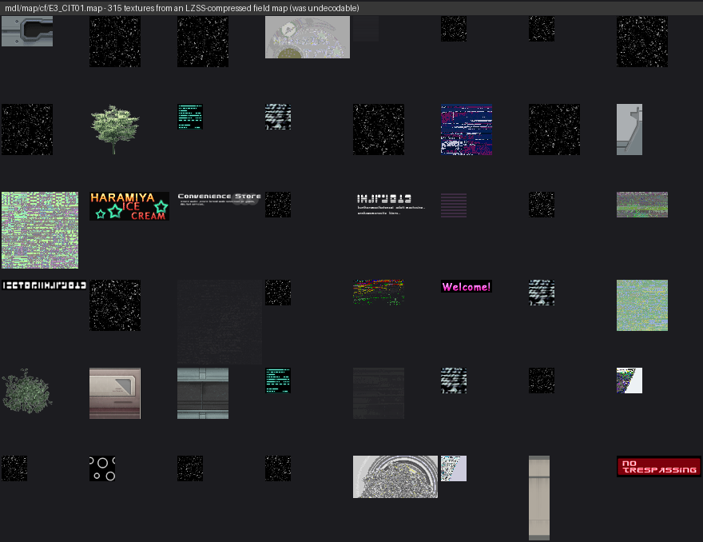
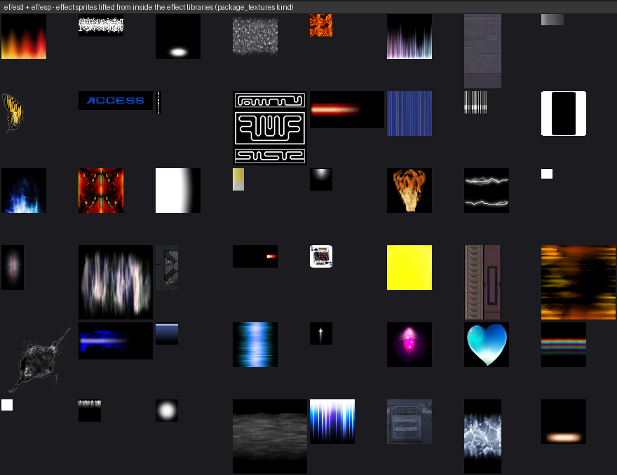
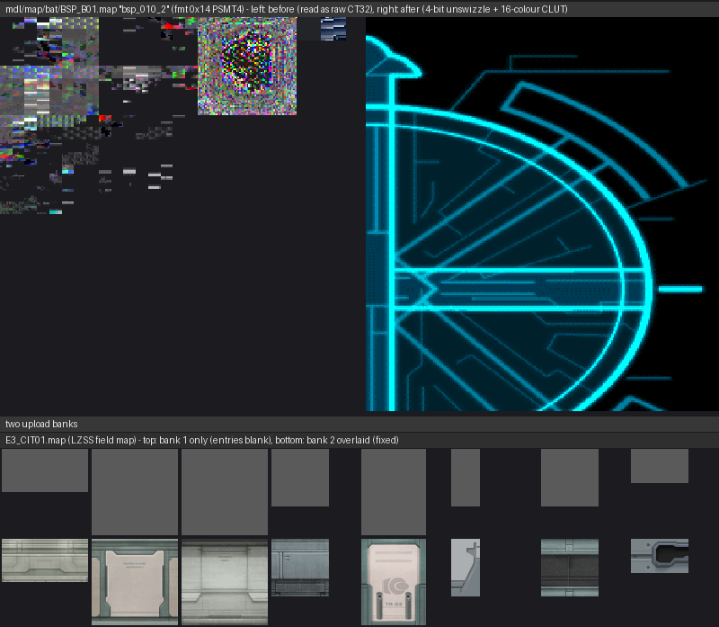
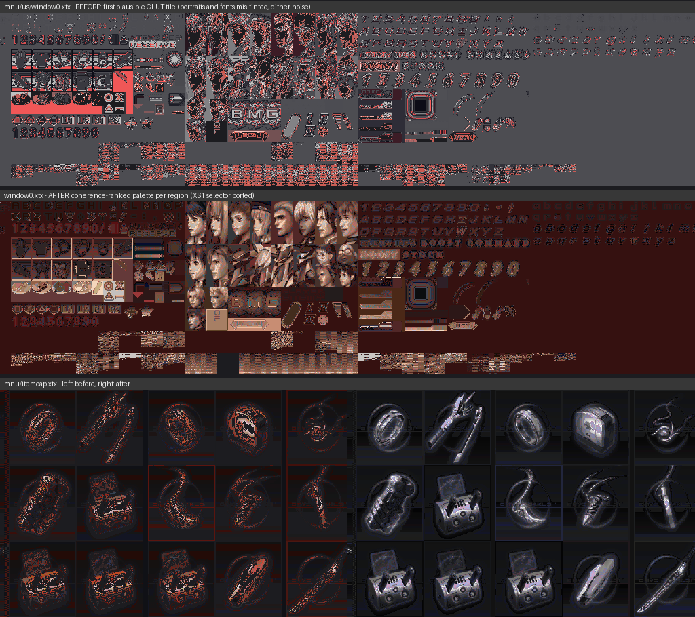

# Updates

Newest first. Each entry lists what changed, why, and what you have to do
to benefit from it. (Same convention as the Xenosaga I kit's
`docs/UPDATES.md`; this file starts with the first improvement run ported
back from that project.)

## 2026-09-24 — improvement run ported from the Xenosaga I kit

Everything the XS1 extractor learned the hard way over the summer was
re-checked against the XS3 discs. Five of those lessons turned out to
apply directly; two of them overturn statements in older docs. All of it
is on the **extract/browse (viewing) side** — nothing changes what
`repack-*` / `chr-iso-*` write to an ISO.



### "No compression anywhere" was wrong: the field maps are LZSS-packed

98 of the 168 `mdl/map/*.map` packages on Disc 1 (every `E3_*` town and
dungeon) carry the version word `0x0401` instead of `0x0001`, a
decompressed size at +0x04 that is larger than the file, and a payload
that goes to noise right after the header. The XS1 lesson ("when a
coherent header runs into noise and the sizes disagree, look for
compression before inventing a format variant") led straight to the
loader in the SLUS decompile: `FUN_001b7330` switches on the version and
runs one of four LZSS decoders. All four are ported in the new
[`xcpack.py`](../xcpack.py) (spec in its docstring and in
[chr-txy-format.md](chr-txy-format.md)); every compressed map on the disc
decodes to exactly the size its header claims.

* `chrtex.py` and the browse sweep decompress transparently — `chr-decode`
  now works on any `.map`. Editing commands refuse compressed packages
  (an edited copy would not fit its disc slot without a recompressor;
  characters and weapons are stored uncompressed and edit as before).
* New CLI command `xc-unpack <package> [--out file]` prints a package's
  version / sub-resources and writes the stored (decompressed) form.

### Textures inside other files: `package_textures` browse kind

XS1 found ~3,000 textures embedded in effect libraries and scene
archives. XS3 has the same thing, in the `txy` resource the character
work already decoded:

| Carrier | What is inside |
|---------|----------------|
| `mdl/chr/*.chr`, `mdl/wpn/*.wpn` | the character / weapon atlases (previously reachable only one file at a time via `chr-decode`) |
| `mdl/map/*.map` | every field and battle backdrop texture (compressed maps included) |
| `ef/esd/**/*.esd`, `ef/esp/*.esp` | free-standing txy records: the particle / effect sprites (fire, lightning, glyphs, cards…) |
| `pac/**/*.sme` | the `esp` member repeats the effect records of the character's techs (all duplicates of `ef/`) |

`browse --kinds package_textures` decodes all of it to
`browse/textures_png/_packages/<carrier>/NN_name.png`, de-duplicates by
pixel hash, and writes `browse/package_textures.csv` (carrier, record
offset, entry name, GS format, size, sha1, written path or the duplicate
it matches, `lzss` when the carrier was decompressed). Disc 1 + the
shared X3.0x data: **~20,900 unique textures, ~18,000 duplicates**.



### PSMT4 (fmt `0x14`) textures decode



A quarter of the package entries are 4-bit (`fmt = 0x14`, the GS PSMT4
code — the entry `fmt` field is literally the GS PSM value). The old
decoder treated anything that was not `0x13` as raw CT32, so those came
out as noise. The 4-bit swizzle (block order, column word/nibble tables,
odd-column word swap) was derived against the proven 8-bit path and
verified on the battle backdrops; the 16-colour CLUT is an 8×2 CT32 tile
at the entry's `pal_x/pal_y`.

### Two more txy findings that changed decoding

* **The strip count is in the table header** (`record 0` word 5). The
  8-strip field maps have no zero terminator after strip 7 — the entry
  table follows directly — so "read strips until a zero record" swallowed
  entry 0 as a bogus 64×64 strip and stamped it over the canvas corner.
* **Field maps upload two texture banks.** A txy of version 2 points (at
  +0x14) to a second strip table that shares the entry table; the engine
  uploads bank 1 then bank 2 over it (bank 2 is narrower in its lower
  pages, so bank-1 pixels survive there). Decoding against bank 1 alone
  left a third of a town's entries fully transparent; against the overlay,
  none. Residual: a dozen entries per big map (glass-reflection sheets,
  flags) still read as noise — runtime palette state we do not have.

### Hidden text: `.txd` is menu text, `.sb` holds the field dialogue

* `.txd` was catalogued as "probably RenderWare TXD, not decoded". It is a
  **text table** (offset table + NUL-terminated strings): `menutext.txd`
  (907 strings — the whole menu UI), `synopsis.txd`, `discchg.txd`,
  `devchk.txd`. Decoded by the `text` kind as `*.txd.txt`, one
  `index<TAB>string` per line.
* `cf/us/*.sb` ("sound bank" in the old catalog) is the **scene script
  bank**: its string section is the in-map dialogue and choices ("Board
  the E.S.?", "Yes\nNo"), voice-cue ids, and the writers' EUC-JP scene
  notes ("＊BGM設定＊", stage directions) the US disc still ships. The
  XS1 kit's `.info` files were EUC-JP too — same studio habit. Decoded
  structurally as `*.sb.strings.txt`.
* `mnu/us/*.bin` databases (character / enemy / item / segment text),
  `mg1/us/Message.Dat` and friends are sniffed generically (printable
  ASCII runs) as `*.strings.txt`. `.t` scene manifests (tab-separated
  text) join the `text` kind. Disc 1: 4 `.txd` + ~730 string tables.

### Swizzled UI sheets: coherence-ranked palettes



The 8 standalone `fmt = 0x08` XTX sheets (window0-2, itemcap, segcap,
ctrl, titleobj, Picture) used the *first plausible* CLUT tile. XS1's
selector (GitHub issue #1 there) is ported: every CLUT-looking tile is a
candidate, the base palette is the one whose render is most spatially
coherent with a transparency penalty, and 64-px blocks that still read as
noise are repainted with the candidate that renders them smoother; the
chosen tiles are blanked. window0's portraits and fonts now read
correctly; multi-palette regions are tinted per block. `*_index.png`
ground-truth maps are still written.

### What the text sweep actually reads like

`cf/us/2940.sb` (a Miltia field scene), straight from `*.sb.strings.txt`:

```
[Barth]<l2>Realians of the same model as me\nare displaying strange behaviors.<w45>
[Barth]<l3>I can't exactly explain it, but they\nseem to take actions completely\nunrelated to their own will.<w45>
[Corel]<l2>And?<w15> Are you showing\nsigns of that?<w45>
[Barth]<l2>Well,<w15> I start to hear\nsomeone singing.<w45>
[Corel]<l2>Singing?<w15> That's odd.<w15>\nI wonder what the cause is.<w45>
[Owusu]<l3>There's this girl who's always\ngrowing flowers at that hospital\nup ahead!<w45>
[Emil]<l2>She's weird.<w15> She spends\nall her time at a hospital!<w45>
```

`<lN>` picks the speaker's portrait/line slot, `<wNN>` is a wait in
frames, `\n` a line break. The same bank's EUC-JP block is the writers'
scene index — `≪レンヌ・ル・シャトー、KOS-MOSと墓標≫` ("Rennes-le-Château,
KOS-MOS and the grave marker") — and `mnu/us/DBC.bin` is the in-game
encyclopedia (Ernest Luis, Aizen Magus … full entries).

### Audio, for the record

Nothing new was needed to *decode* it, but the survey confirmed what is
where: streamed BGM is `snd/adx/M*.adx` (10 tracks on Disc 1, 18 s –
132 s each, plus `E*.adx` event streams and `S*.adx`), battle callouts in
`snd/adx/bat_voice/`, movie/event voice in `snd/adx/mev/`, system
jingles in `snd/adx/sys/`; the `.dap` banks (`snd/dat/Master.dap` 55
cues, `CIT.dap` 15 …) and the per-character banks inside `pac/cf/*.sme`
hold the SE. Audio is not committed to the repository — decode your own
disc with `browse --kinds audio,soundbanks`.

### Sound banks inside `.sme`

Every combatant bundle with a `dap` sub-resource carries a complete DTPK
bank (the character's battle voice/SE cues). The `soundbanks` kind now
decodes them as `soundbanks/pac/<...>/<stem>_dap_NN.wav`.

### To pick this up

Re-run `browse` on an existing dump — no re-extract:

```
python cli.py browse --dump work/dump --stage work/browse_stage --out work/browse \
    --kinds text,textures_png,package_textures,soundbanks
```

`package_textures` is pure Python and multi-process (`--jobs`); budget a
few minutes per disc. The GUI's "Build browse" card lists the new kind.
Packaged Windows builds predate all of this until the release workflow is
re-run.

### Still open (carried into the next run)

* `.xep` event packages start with `Xc\x01\x03` but are not MR packages
  and do not decode with any of the four LZSS flavours — the event loader
  has its own scheme.
* **The UI sheets are still wrong-tinted** (sepia portraits, grey item
  icons). The coherence ranking cannot tell a monotone ramp palette from
  the true one — under a ramp every index map renders "smooth" — and a
  colourfulness tie-breaker tried on 2026-09-24 made things worse
  (wrong palettes pass the gate, portraits wash out), so it was not
  shipped. A 5-word sprite table found in SLUS at 0x2e3c54 (`w, h, u, v,
  id`; 139 records) binds a *different* sheet (font glyphs). The real
  fix is runtime ground truth: TEX0 CBP/CSA values captured from EE RAM
  while the menu is open (PINE), or the sprite tables the menu code
  builds for window0-2.
* Which palette the engine binds to the noisy residual map entries.
* `.shp` shop tables (item-id byte lists), `.chp` character packs
  (`0x60`-word header, not Xc), `.esd`/`.esp` script bodies.
